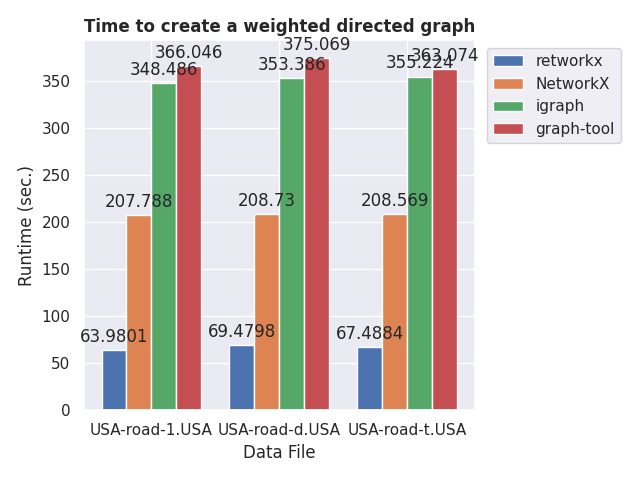
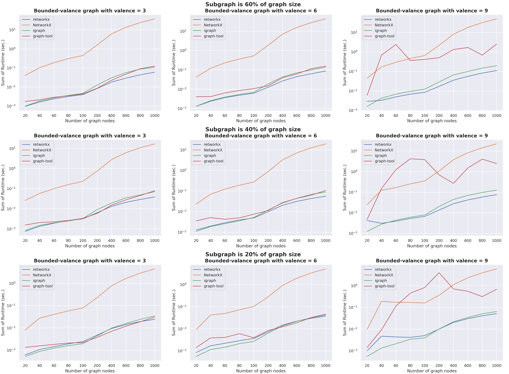

>> Network and graph analysis is a widely applicable field of research, and Python is a popular programming language. In _[retworkx](https://github.com/Qiskit/retworkx)_, we provide a high-performance, flexible graph and network analysis library for Python. _retworkx_ is inspired by _NetworkX_ [@SciPyProceedings_11] but addresses many performance concerns of the latter. _retworkx_ is particularly suited for performance-sensitive applications that use graph representations.

# Statement of need

_retworkx_ is a general-purpose graph theory library focused on performance. It wraps low-level Rust code [@Matsakis2014] into a flexible Python API, providing fast implementations for popular graph algorithms.

_retworkx_ originated from the performance demands of the Qiskit compiler [@Qiskit2021]. At first, Qiskit used the _NetworkX_ library [@SciPyProceedings_11] to construct directed acyclic graph (DAG) representations of quantum circuits which the compiler operates on to perform analysis and transformations [@Childs2019]. As the development of Qiskit progressed, the input size of the executed quantum circuits grew, and _NetworkX_ started to become a bottleneck. Hence, _retworkx_ development emerged to cover the graph usage in Qiskit. The library is now also used by other projects [@Ullberg2021; @Jha2021].

# Related work

To address the performance issues in Qiskit, we explored several graph library alternatives. _igraph_ [@Csardi2006], _graph-tool_ [@Peixoto2014], and _SNAP_ [@Leskovec2016] are Python libraries written in C or C++ that can replace _NetworkX_.

However, there was a strong desire to keep the flexibility that _NetworkX_ provided for exploring and interacting with the graphs, which precluded custom application-specific graph data structures. The graph libraries mentioned above either had issues integrating with Qiskit or APIs that were too rigid, such that the migration of existing code was more complex than desired. Thus, the main contribution of _retworkx_ is keeping the ease of use of _NetworkX_ without sacrificing performance.

# Graph data structures

_retworkx_ provides two core data structures: `PyGraph` and `PyDiGraph`. They correspond to undirected and directed graphs, respectively. Graphs describe a set of nodes and the edges connecting pairs of those nodes. Internally, _retworkx_ leverages the _petgraph_ library [@bluss2021] to store the graphs and the _PyO3_ library [@Hewitt2021] for the Python bindings.

Nodes and edges of the graph may also be associated with weights. Weights can contain arbitrary data, such as node labels or edge lengths. Any Python object can be a weight, which makes the library flexible because no assumptions are made about the weight types. 

_retworkx_ operates on weights with callbacks. Callbacks are functions that take weights and return statically typed data. They resemble the named attributes in _NetworkX_. Callbacks are beneficial because they bridge the arbitrary stored data with the static types _retworkx_ expects.

A defining characteristic of _retworkx_ graphs is that each node maps to a non-negative integer node index, and similarly, each edge maps to an edge index. Those indices uniquely determine nodes and edges in the graph. Moreover, the indices provide a clear separation between the underlying graph structure and the data associated with weights.

{ width=100% height==100% }

# Use Cases

_retworkx_ is suitable for modeling graphs ranging from a few nodes scaling up to millions. The library is particularly suited for applications that have core routines executing graph algorithms, such as Qiskit. In those applications, the performance of _retworkx_ considerably reduces computation time.

We demonstrate the library's performance and use cases comparing _retworkx_ to other popular graph libraries^[_SNAP_ was not included in the benchmarks because its Python wrapper did not contain the required functions] on a benchmark:

| Library   | _retworkx_| _NetworkX_ | _python-igraph_ | _graph-tool_ |
|-----------|-----------|------------|-----------------|-------------|
| Version ^[_retworkx_, _NetworkX_, and _igraph_ were installed from PyPI (Python Package Index) with the **`pip`** command]\textsuperscript{,}  ^[_graph-tool_ does not publish packages on PyPI and had to be compiled and installed manually]\textsuperscript{,} ^[_retworkx_ and _igraph_ provide precompiled wheel binaries [@pep427], hence no Rust or C compilers were required. _graph-tool_ required a C++ compiler and all of the C++ library dependencies]   | 0.10.2    | 2.6.3      | 0.9.6           | 2.43        |

The benchmark is [available on Github](https://github.com/mtreinish/retworkx-comparison-benchmarks)^[https://github.com/mtreinish/retworkx-comparison-benchmarks] for reproducibility. We present results conducted on the same machine running Python 3.9.7, with 128GB of DDR4 RAM @ 3200MHz and Intel(R) Core i7-6900K CPU @ 3.20GHz with eight cores and 16 threads. 

## Graph Creation

The first use case is to represent real-world networks by creating graphs with their respective nodes and edges. We compare the time to create graphs representing the USA road network from the 9th DIMACS challenge dataset [@Demetrescu2009]. Each graph contains $\lvert V \rvert = 23,947,347$ nodes and $\lvert E \rvert = 58,333,344$ weighted edges.

The results in Figure \ref{fig:creation} shows that _retworkx_ is on average 3x faster than _NetworkX_ on this benchmark. _retworkx_ is also the fastest among all libraries, being at least 5x faster than _igraph_ and _graph-tool_.

{ width=90% height=90% }

## Shortest Path

The second use case is to calculate the distance among nodes in a graph using Dijkstra's algorithm [@Dijkstra1959ANO]^[_igraph_ and _graph-tool_ use Johnson's algorithm [@Johnson1977] for all-pairs shortest paths, which contains Dijkstra's as a subroutine]. We compare two scenarios. In the first scenario, we calculate the distance between the first and the last node in the USA road network. In the second scenario, we calculate the distance among all nodes in the City of Rome road network, with the dataset also coming from the 9th DIMACS challenge [@Demetrescu2009]. The City of Rome network has $\lvert V \rvert = 3,353$ nodes and $\lvert E \rvert = 8,870$ weighted edges.

\begin{multicols}{2}
\begin{figure}
\centering
\includegraphics[width=0.45\textwidth,height=0.45\textheight]{paper_img/single_source_shortest_path.png}
\caption{Time to find the shortest path between two nodes in the USA road network.}
\label{fig:sssp}
\end{figure}

\begin{figure}
\centering
\includegraphics[width=0.45\textwidth,height=0.45\textheight]{paper_img/all_pairs.png}
\caption{Time to find the shortest path among all nodes in the City of Rome road network.}
\label{fig:allpairs}
\end{figure}
\end{multicols}

_retworkx_ is 6x faster than _NetworkX_ on the single-source scenario, and 104x faster on the all-pairs scenario as shown in Figures \ref{fig:sssp} and \ref{fig:allpairs}. We highlight that _NetworkX_ is the slowest library among all in the benchmark because it was designed with different goals in mind, such as readability and ease of distribution.

_retworkx_ is the second-fastest in the single-source scenario after _graph-tool_, but we interpret the result as a trade-off. _graph-tool_ is 1.6-1.8x faster than _retworkx_ on the single-source shortest-path calculation but takes 5x longer to create the graph, as shown in the other benchmark. _retworkx_ creates graphs faster and trades some of the shortest-path calculation performance to accept Python callbacks that work with arbitrary data types. In the all-pairs scenario, _retworkx_ is the fastest with a 5.6x speedup compared to _graph-tool_ which is the second-fastest.

## Subgraph Isomorphism

The third use case is to detect a pattern graph within a larger graph using the VF2 or VF2++ algorithms [@Cordella2004;@Juttner2018]. We compare the time to answer if pairs of graphs from the ARG Database are subgraph-isomorphic [@DeSanto2003]. The graphs are unlabeled, bounded-valence graphs ranging from $20$ to $1000$ nodes with valence $\upsilon \in \{3, 6, 9 \}$. They are organized in pairs such that the subgraph size is either $20 \%$, $40 \%$ or $60 \%$ of the full graph.

The results in Figure \ref{fig:subgraphisomorphism} show that _retworkx_ consistently outperforms _NetworkX_ by two orders of magnitude. For $n = 1000$ nodes, _retworkx_ has averaged around the order of $10^{-1}$ seconds while _NetworkX_ is closer to the order of $10^{1}$ seconds. Compared to other libraries, _retworkx_ leads the benchmark together with _igraph_, albeit _retworkx_ performs slightly better as the number of nodes grows larger.

{ width=90% height=100% }

# Acknowledgements

We thank Kevin Krsulich for his help in getting _retworkx_ ready for use by Qiskit; Lauren Capelluto and Toshinari Itoko for their continued support and help with code review; and all of the _retworkx_ contributors who have helped the library improve over time.

# References
