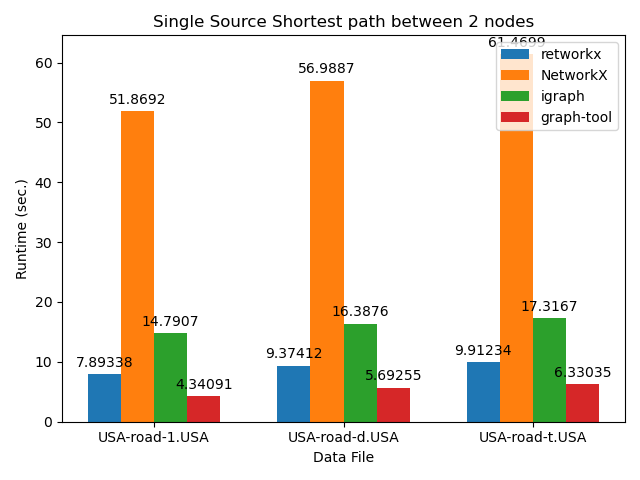
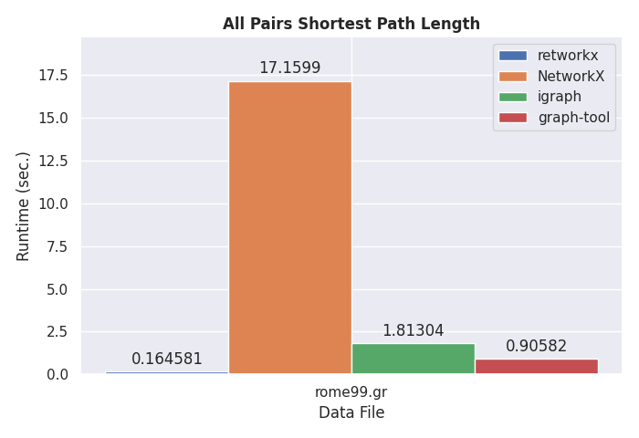

&nbsp;

>> Network and graph analysis is a widely applicable field of research, and Python is a popular language. In _[retworkx](https://github.com/Qiskit/retworkx)_, we provide a high-performance, flexible graph and network analysis library for Python. _retworkx_ is inspired by _NetworkX_ [@SciPyProceedings_11] but addresses many performance concerns of the latter. _retworkx_ is particularly suited for performance-sensitive applications that use graph representations.

# Statement of need

_retworkx_ is a general-purpose graph theory library focused on performance. It wraps low-level Rust code [@Matsakis2014] into a flexible Python API, providing fast implementations for popular graph algorithms.

_retworkx_ originated from the performance demands of the Qiskit compiler [@Qiskit2021]. At first, Qiskit used the _NetworkX_ library [@SciPyProceedings_11] to construct directed acyclic graph (DAG) representations of quantum circuits which the compiler operates on to perform analysis and transformations [@Childs2019]. As the development of Qiskit progressed, the input size of the executed quantum circuits grew, and _NetworkX_ started to become a bottleneck. Hence, _retworkx_ development emerged to cover the graph usage in Qiskit. The library is now also used by other projects [@Ullberg2021; @Jha2021].

# Related work

To address the performance issues in Qiskit, we explored several graph library alternatives. _igraph_ [@Csardi2006], _graphtool_ [@Peixoto2014], and _SNAP_ [@Leskovec2016] are stable Python libraries written in C or C++ that can replace _NetworkX_.

However, there was a strong desire to keep the flexibility that _NetworkX_ provided for exploring and interacting with the graphs, which precluded custom data structures. The investigated graph libraries either had issues integrating with Qiskit or APIs that were too rigid, such that the migration of existing code was more complex than desired. Thus, the main contribution of _retworkx_ is keeping the ease of use of _NetworkX_ without sacrificing performance.

# Graph data structures

_retworkx_ provides two core data structures: `PyGraph` and `PyDiGraph`. They correspond to undirected and directed graphs, respectively. Graphs describe a set of nodes and the edges connecting pairs of those nodes. Internally, _retworkx_ leverages the _petgraph_ library [@bluss2021] to store the graphs and the _PyO3_ library [@Hewitt2021] for the Python bindings.

Nodes and edges of the graph may also be associated with weights. Weights can contain arbitrary data, such as node labels or edge lengths. Any Python object can be a weight, which makes the library flexible because no assumptions are made about the weight types. 

_retworkx_ operates on weights with callbacks. Callbacks are functions that take weights and return statically typed data. They resemble the named attributes in _NetworkX_. Callbacks are beneficial because they bridge the arbitrary stored data with the static types _retworkx_ expects.

A defining characteristic of _retworkx_ graphs is that each node maps to a non-negative integer node index, and similarly, each edge maps to an edge index. Those indices uniquely determine nodes and edges during the graph object's lifetime. Moreover, the indices provide a clear separation between the underlying graph structure and the data associated with weights. We illustrate indices and callbacks usage with an example.

## Example

```python
import retworkx

graph = retworkx.PyGraph()

a = graph.add_node("A")
b = graph.add_node("B")
c = graph.add_node("C")

graph.add_edges_from([(a, b, 1.5), (a, c, 5.0), (b, c, 2.5)])
retworkx.dijkstra_shortest_paths(graph, a, c, weight_fn=float)
```

In the provided example, we find the shortest path from $A$ to $C$ using Dijkstra's algorithm [@Dijkstra1959ANO]. Firstly, we create the graph and add three nodes labeled A, B, and C. Each time **`add_node`** is called, the method returns the node index associated with the newly added node.

Secondly, we add three edges connecting the nodes. **`add_edges_from`** accepts a list containing tuples of node indices and the edge weight, and returns a list of associated edge indices.

Lastly, we compute the shortest path from $A$ to $C$. We provide the graph, the source node, and the target node to **`dijkstra_shortest_paths`**. In addition, we also provide a callback to **`weight_fn`**, which is the built-in **`float`** function for this case. The algorithm returns a mapping containing the shortest path, $A \rightarrow B \rightarrow C$.

# Use Cases

_retworkx_ is suitable for modeling graphs ranging from a few nodes scaling up to millions and inherits the network science applications. The library is particularly suited for applications that have core routines executing graph algorithms, such as Qiskit. In those applications, the performance of _retworkx_ makes the difference because it reduces computation time considerably.

To demonstrate _retworkx_'s performance, we conducted a benchmark comparing _retworkx_ to other popular graph libraries^[_SNAP_ was dropped from benchmarks because its Python wrapper did not contain most of the functions tested in this benchmark]:

| Library   | _retworkx_| _NetworkX_ | _python-igraph_ | _graphtool_ |
|-----------|-----------|------------|-----------------|-------------|
| Version   | 0.10.2    | 2.6.3      | 0.9.6           | 2.43        |

The benchmark is [available on Github](https://github.com/mtreinish/retworkx-comparison-benchmarks)^[https://github.com/mtreinish/retworkx-comparison-benchmarks] for reproducibility. We present results conducted on the same machine running Python 3.9.3, with 128GB of DDR4 RAM @ 3200MHz and Intel(R) Core i7-6900K CPU @ 3.20GHz with eight cores and 16 threads.

_retworkx_ is competitive and TODO. TODO.

## Graph Creation

TODO: benchmark using 9th DIMACS challenge dataset [@Demetrescu2016].

{ width=50% height=50% }

## Shortest Path

Talk about wide-range of applications. TODO: benchmark using 9th DIMACS challenge dataset [@Demetrescu2016].

{ width=50% height=50%  }

{ width=50% height=50% }

## Graph Isomorphism

Talk about definition [@Cordella2001], applications [@Raymond2002] and VF2++ [@Juttner2018]. TODO: benchmark on ARG Database from MIVIA group [@DeSanto2003] or on the more challenging [@Neuen2017].

# Acknowledgements

We thank Kevin Krsulich for his help in getting retworkx ready for use by Qiskit; Lauren Capelluto and Itoko Toshinari for their continued support and help with code review; and all of the retworkx contributors who have helped the library improve over time.

# References
