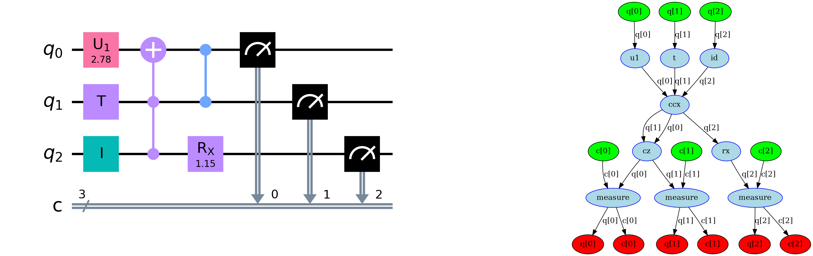

>> In _[retworkx](https://github.com/Qiskit/retworkx)_, we provide a high-performance, flexible graph library for Python. _retworkx_ is inspired by _NetworkX_ but addresses many performance concerns of the latter. _retworkx_ is written in Rust and is particularly suited for performance-sensitive applications that use graph representations.

# Statement of need

_retworkx_ is a general-purpose graph theory library focused on performance. It wraps low-level Rust code [@Matsakis2014] into a flexible Python API, providing fast implementations for graph data structures and popular graph algorithms.

_retworkx_ is inspired by the _NetworkX_ library [@SciPyProceedings_11], but meets the needs of users that also need performance. Even though _NetworkX_ is the de-facto standard graph and network analysis library for Python, it shows performance concerns. _NetworkX_ prefers pure Python implementations, which leads to bottlenecks in computationally intensive applications that use graph algorithms. 

_retworkx_ addresses those performance concerns by switching to a Rust implementation. It has support for shortest paths, isomorphism, matching, multithreading via rayon [@Stone2021], and much more.

# Related work
  
The graph and network analysis ecosystem for Python is rich, with many libraries available. _igraph_ [@Csardi2006], _graph-tool_ [@Peixoto2014], _SNAP_ [@Leskovec2016], and _Networkit_ [@Staudt2016] are Python libraries written in C or C++ that can replace _NetworkX_ with better performance. We also highlight _SageMath_'s graph theory module [@Sagemath2020], which has a stronger focus in mathematics than _NetworkX_. 

However, the authors found that no library matched the flexibility that _NetworkX_ provided for interacting with graphs. _igraph_ is efficient for static large graphs, but does not handle graph updates as efficiently. _SNAP_ and _Networkit_ do not support weights with arbitrary Python types. _graph-tool_ supports graph weights at the cost of maintaing the weights in a separate data structure. Thus, the main contribution of _retworkx_ is keeping the ease of use of _NetworkX_ without sacrificing performance.

# Graph data structures

_retworkx_ provides two core data structures: `PyGraph` and `PyDiGraph`. They correspond to undirected and directed graphs, respectively. Graphs describe a set of nodes and the edges connecting pairs of those nodes. Internally, _retworkx_ leverages the _petgraph_ library [@bluss2021] to store the graphs using an adjacency list model and the _PyO3_ library [@Hewitt2021] for the Python bindings.

Nodes and edges of the graph may also be associated with weights. Weights can contain arbitrary data, such as node labels or edge lengths. Any Python object can be a weight, which makes the library flexible because no assumptions are made about the weight types. 

_retworkx_ operates on weights with callbacks. Callbacks are functions that take weights and return statically typed data. They resemble the named attributes in _NetworkX_. Callbacks are beneficial because they bridge the arbitrary stored data with the static types _retworkx_ expects.

A defining characteristic of _retworkx_ graphs is that each node maps to a non-negative integer node index, and similarly, each edge maps to an edge index. Those indices uniquely determine nodes and edges in the graph. Moreover, the indices provide a clear separation between the underlying graph structure and the data associated with weights.

{ width=100% height==100% }

# Use Cases

_retworkx_ is suitable for modeling graphs ranging from a few nodes scaling up to millions. The library is particularly suited for applications that have core routines executing graph algorithms. In those applications, the performance of _retworkx_ considerably reduces computation time. Examples of applications using _retworkx_ include the Qiskit compiler [@Qiskit2021], PennyLane [@Bergholm2020], atompack [@Ullberg2021], and qtcodes [@Jha2021].

For common use cases, _retworkx_ can provide speedups ranging from 3x to 100x faster compared to the same code using _NetworkX_ while staying competitive with other compiled libraries like _igraph_ and _graph-tool_. The gains in performance are application-specific, but as a general rule, the more work that is offloaded to _retworkx_ and Rust, the larger are the gains.     

We illustrate use cases with examples from the field of quantum computing that motivated the development of the library.

## Graph Creation, Manipulation, and Traversal

The first use case is based on the manipulation of directed acyclic graphs (DAGs) by Qiskit using _retworkx_. Qiskit represents quantum circuits as DAGs which the compiler operates on to perform analysis and transformations [@Childs2019].

{ width=100% height==100% }

Qiskit creates a DAG whose nodes represent either OpenQASM instructions or registers [@Cross2021] and whose edges represent the registers each instruction operates on. Qiskit also applies transformations to the instructions, which manipulates the graph by adding and removing nodes and edges. _retworkx_ brings the graph data structure underlying those operations.

In addition, Qiskit needs to traverse the graph. Some transformations, such as greedily merging instructions to reduce circuit depth, require graph traversal. _retworkx_ offers the methods for traversals such as breadth-first search, depth-first search, and topological sorting.

## Subgraph Isomorphism

The second use case is based on qubit mapping problem for Noisy Intermediate-Scale Quantum (NISQ) devices [@Bharti2021]. NISQ devices do not have full connectivity among qubits, hence Qiskit needs to take into account an undirected graph representing the connectivity of the device when compiling quantum circuits. Qiskit transforms the quantum circuit such that the pairs of qubits executing two-qubit gates respect the device's architectural constraints. There are many proposed solutions to the qubit mapping problem, including algorithms based on subgraph isomorphism [@Li2021].

{ width=52.5% height==52.5% }

_retworkx_ implements both VF2 [@Cordella2004] and VF2++ [@Juttner2018] algorithms to solve subgraph isomorphism. The implementations include both checking if a mapping exists and returning a mapping among the nodes. Qiskit leverages _retworkx_ to provide an experimental layout method based on VF2++. Qiskit checks if the graph representing the connectvity required by the circuit and the connectivity provided by the device are subgraph isomorphic. If they are, Qiskit uses VF2++ mapping to map the qubits without adding SWAP instructions to the quantum circuit. 

# Limitations

_retworkx_ is not a drop-in replacement for _NetworkX_. Existing code using _NetworkX_ needs to be modified to use _retworkx_. The authors are aware of the limitation and provide a _NetworkX_ to _retworkx_ conversion guide on the documentation.

# Acknowledgements

We thank Kevin Krsulich for his help in getting _retworkx_ ready for use by Qiskit; Lauren Capelluto and Toshinari Itoko for their continued support and help with code review; and all of the _retworkx_ contributors who have helped the library improve over time.

# References
